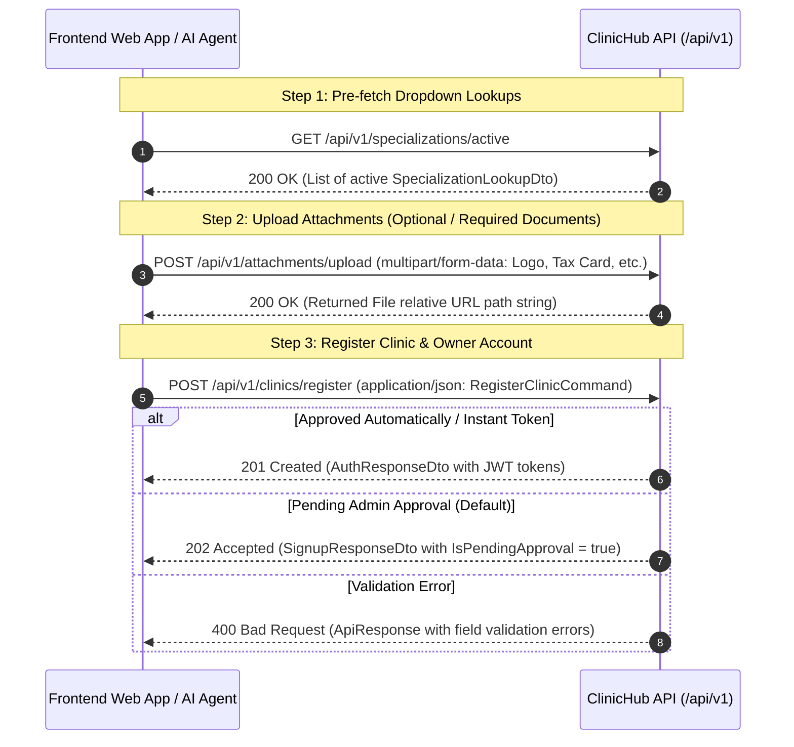

# ClinicHub - Register Clinic Frontend Web Integration Guide

This document is an integration guide designed for **frontend web developers** and **AI coding agents** working on client applications (React, Vue, Next.js, Angular, Mobile Web, Vanilla TS/JS). It details the complete multi-step registration workflow for clinics, HTTP endpoints, headers, TypeScript interfaces, exact JSON request/response schemas with all fields, and error handling rules.

---

## 1. Overview & Registration Workflow

The Clinic Registration process consists of three main stages:



---

## 2. Global Headers & Environment Configuration

| Header | Required | Example | Description |
| :--- | :--- | :--- | :--- |
| `Content-Type` | **Yes** (for JSON endpoints) | `application/json` | Required for JSON request bodies. |
| `Accept-Language` | No (Default: `ar`) | `ar` or `en` | Determines the culture/language of error and success messages returned in `message` and `errors`. |
| `Authorization` | No | `Bearer <token>` | **Not required** for registration (`[AllowAnonymous]`). |

---

## 3. Step-by-Step API Specification

### Step 1: Get Active Specializations (Public Lookup)
Retrieves the list of active medical specializations to populate the Specialization dropdown menu.

- **HTTP Method**: `GET`
- **Route**: `/api/v1/specializations/active`
- **Authentication**: None (Anonymous)

#### Response Body (`200 OK`)
```json
{
  "success": true,
  "errors": {},
  "data": [
    {
      "id": "3fa85f64-5717-4562-b3fc-2c963f66afa6",
      "arName": "طب الأسنان",
      "name": "Dentistry",
      "isFamous": true
    },
    {
      "id": "b1a2c3d4-5717-4562-b3fc-2c963f66afa7",
      "arName": "الجلدية",
      "name": "Dermatology",
      "isFamous": true
    }
  ],
  "message": null,
  "statusCode": 200
}
```

---

### Step 2: Upload Attachments & Documents
Upload files (Logo, Professional Practice Card Image, Tax Card Image, Union ID Card Image, Doctor Image) prior to clinic submission.

- **HTTP Method**: `POST`
- **Route**: `/api/v1/attachments/upload`
- **Content-Type**: `multipart/form-data`

#### Form-Data Parameters
| Field Name | Type | Required | Description |
| :--- | :--- | :--- | :--- |
| `File` | `File` (Binary) | **Yes** | The image or document file to upload. |
| `Place` | `integer` | **Yes** | Attachment placement enum code (e.g., `1` = Profile, `2` = Verification, `3` = Clinic). |
| `FileType` | `integer` | **Yes** | File media type code (`1` = Image, `2` = Document/PDF, `3` = Video). |

#### Response Body (`200 OK`)
```json
{
  "success": true,
  "errors": {},
  "data": "/files/attachments/clinic-logo-2026.png",
  "message": null,
  "statusCode": 200
}
```

---

### Step 3: Register Clinic (`POST /api/v1/clinics/register`)
Registers a new clinic owner user account, creates the clinic profile, and submits doctor verification documents for administrative review.

- **HTTP Method**: `POST`
- **Route**: `/api/v1/clinics/register`
- **Content-Type**: `application/json`

---

## 4. Full Request & Response Schemas (All Fields)

### Full Request Body Schema (`RegisterClinicCommand`)

Below is the **complete JSON request body containing all supported fields**:

```json
{
  "fullName": "Dr. Ahmed Ali",
  "email": "dr.ahmed.ali@example.com",
  "phoneNumber": "+201012345678",
  "password": "SecurePassword123!",
  "birthDate": "1988-04-15T00:00:00.000Z",
  "gender": 1,
  "fcmToken": "fcm_device_token_sample_string_xyz_123",
  "devicePlatform": 3,
  "clinicName": "Hope Medical Center",
  "clinicNameAr": "مركز الأمل الطبي",
  "clinicDescription": "A specialized dental and skin care clinic with state-of-the-art technology.",
  "clinicAddress": "Building 12, Street 9, Maadi, Cairo, Egypt",
  "clinicPhone": "+20223456789",
  "clinicEmail": "info@hopemedical.com",
  "specializationId": "3fa85f64-5717-4562-b3fc-2c963f66afa6",
  "workingHours": "09:00 AM - 09:00 PM",
  "workingHoursStart": "09:00:00",
  "workingHoursEnd": "21:00:00",
  "workingDays": [
    "Saturday",
    "Sunday",
    "Monday",
    "Tuesday",
    "Wednesday",
    "Thursday"
  ],
  "lat": 30.0444,
  "lng": 31.2357,
  "logo": "/files/attachments/clinic-logo-2026.png",
  "professionalPracticeCardImage": "/files/attachments/practice-card.jpg",
  "taxCardImage": "/files/attachments/tax-card.jpg",
  "unionIdCardImage": "/files/attachments/union-card.jpg",
  "doctorImage": "/files/attachments/doctor-photo.jpg",
  "bio": "Consultant Dental Surgeon with over 12 years of experience in restorative and cosmetic dentistry.",
  "yearsOfExperience": 12
}
```

#### Detailed Request Field Definitions & Constraints

| Field | Type | Required | Constraints / Validation | Description |
| :--- | :--- | :--- | :--- | :--- |
| `fullName` | `string` | **Yes** | Max 100 characters | Full name of the clinic owner/doctor. |
| `email` | `string` | **Yes** | Valid email format | User login email address (must be unique). |
| `phoneNumber` | `string` | **Yes** | Required | Contact phone number. |
| `password` | `string` | **Yes** | Min 6 characters | User account password. |
| `birthDate` | `string` (ISO 8601) | Optional | Format: `YYYY-MM-THH:mm:ssZ` | Owner's date of birth. |
| `gender` | `integer` | **Yes** | Enum: `1` = Male, `2` = Female | Owner's gender. |
| `fcmToken` | `string` | Optional | String | Firebase Cloud Messaging token for push notifications. |
| `devicePlatform` | `integer` | Optional | Enum: `1` = Android, `2` = iOS, `3` = Web | Operating platform of the client. |
| `clinicName` | `string` | **Yes** | Max 200 characters | Official name of the clinic (English/Primary). |
| `clinicNameAr` | `string` | Optional | Max 200 characters | Arabic localized clinic name. |
| `clinicDescription` | `string` | Optional | Text | General summary/overview of clinic services. |
| `clinicAddress` | `string` | Optional | Text | Physical street address of the clinic. |
| `clinicPhone` | `string` | Optional | Phone format | Direct clinic contact phone number. |
| `clinicEmail` | `string` | Optional | Email format | Official contact email of the clinic. |
| `specializationId` | `string` (UUID) | **Yes** | Must exist in Specializations table | Unique ID of chosen specialization. |
| `workingHours` | `string` | Optional | Display string | Human-readable schedule (e.g. `"09:00 AM - 05:00 PM"`). |
| `workingHoursStart` | `string` (Time) | Optional | Format: `"HH:mm:ss"` | Opening time. |
| `workingHoursEnd` | `string` (Time) | Optional | Format: `"HH:mm:ss"` | Closing time. |
| `workingDays` | `array<string>`| Optional | List of day names | Operating days e.g. `["Saturday", "Sunday", "Monday"]`. |
| `lat` | `number` (double) | Optional | Range: -90.0 to +90.0 | Geolocation Latitude coordinate. |
| `lng` | `number` (double) | Optional | Range: -180.0 to +180.0 | Geolocation Longitude coordinate. |
| `logo` | `string` | Optional | Path/URL | Relative path to clinic logo image returned from upload endpoint. |
| `professionalPracticeCardImage` | `string` | Optional | Path/URL | Image of professional medical license/card. |
| `taxCardImage` | `string` | Optional | Path/URL | Image of official clinic tax card document. |
| `unionIdCardImage` | `string` | Optional | Path/URL | Image of doctor's syndicate/union ID card. |
| `doctorImage` | `string` | Optional | Path/URL | Doctor's professional headshot picture. |
| `bio` | `string` | Optional | Text | Doctor's professional bio summary. |
| `yearsOfExperience` | `integer` | Optional | Min 0 | Total years of medical practice. |

---

### Response Bodies (All Fields)

#### Scenario A: Pending Admin Approval (`202 Accepted` - Default)
When registration is submitted, the clinic status is set to `PendingApproval` and awaits system admin verification.

```json
{
  "success": true,
  "errors": {},
  "data": {
    "userId": "3fa85f64-5717-4562-b3fc-2c963f66afa6",
    "message": "Your registration request has been submitted successfully and is pending admin approval.",
    "isPendingApproval": true
  },
  "message": "Your registration request has been submitted successfully and is pending admin approval.",
  "statusCode": 202
}
```

#### Scenario B: Instant Active Authorization (`201 Created`)
If the clinic auto-activates or does not require manual approval stage.

```json
{
  "success": true,
  "errors": {},
  "data": {
    "accessToken": "eyJhbGciOiJIUzI1NiIsInR5cCI6IkpXVCJ9...",
    "refreshToken": "d3b07384-5717-4562-b3fc-2c963f66afa6",
    "fullName": "Dr. Ahmed Ali",
    "email": "dr.ahmed.ali@example.com",
    "roles": "ClinicOwner",
    "id": "3fa85f64-5717-4562-b3fc-2c963f66afa6",
    "clinicId": "a1b2c3d4-5717-4562-b3fc-2c963f66afa6",
    "profilePictureUrl": "/files/attachments/doctor-photo.jpg",
    "isFreelanceDoctor": false
  },
  "message": "Clinic registered successfully.",
  "statusCode": 201
}
```

#### Scenario C: Validation Error Response (`400 Bad Request`)
If required fields are missing or invalid (e.g. invalid specialization ID, short password, duplicate email).

```json
{
  "success": false,
  "errors": {
    "Email": [
      "The Email field is required.",
      "The Email field is not a valid e-mail address."
    ],
    "Password": [
      "The field Password must be a string with a minimum length of 6."
    ],
    "ClinicName": [
      "The ClinicName field is required."
    ],
    "SpecializationId": [
      "The specified specialization was not found."
    ],
    "Gender": [
      "The Gender field is required."
    ]
  },
  "data": null,
  "message": "Validation failed for one or more fields.",
  "statusCode": 400
}
```

---

## 5. TypeScript Interfaces for Frontend & AI Agents

Frontend applications and AI coding agents can copy and paste the following TypeScript interface definitions directly into their models directory:

```typescript
// Enums
export enum Gender {
  Male = 1,
  Female = 2
}

export enum DevicePlatform {
  Android = 1,
  iOS = 2,
  Web = 3
}

// Lookup DTOs
export interface SpecializationLookupDto {
  id: string;
  arName: string;
  name: string;
  isFamous: boolean;
}

// Upload Attachment DTO
export interface UploadAttachmentResponse {
  success: boolean;
  errors: Record<string, string[]>;
  data: string; // Relative URL string path
  message: string | null;
  statusCode: number;
}

// Request Payload: RegisterClinicCommand
export interface RegisterClinicRequest {
  // Owner Information
  fullName: string;
  email: string;
  phoneNumber: string;
  password: string;
  birthDate?: string | null; // ISO 8601 string: YYYY-MM-DDTHH:mm:ssZ
  gender: Gender;
  fcmToken?: string | null;
  devicePlatform?: DevicePlatform | null;

  // Clinic Information
  clinicName: string;
  clinicNameAr?: string | null;
  clinicDescription?: string | null;
  clinicAddress?: string | null;
  clinicPhone?: string | null;
  clinicEmail?: string | null;
  specializationId: string;
  workingHours?: string | null;
  workingHoursStart?: string | null; // HH:mm:ss
  workingHoursEnd?: string | null;   // HH:mm:ss
  workingDays?: string[] | null;     // e.g. ["Saturday", "Sunday"]
  lat?: number | null;
  lng?: number | null;
  logo?: string | null;

  // Doctor Verification & Information
  professionalPracticeCardImage?: string | null;
  taxCardImage?: string | null;
  unionIdCardImage?: string | null;
  doctorImage?: string | null;
  bio?: string | null;
  yearsOfExperience?: number | null;
}

// Response Payloads
export interface SignupPendingData {
  userId: string;
  message: string;
  isPendingApproval: boolean;
}

export interface AuthResponseData {
  accessToken: string | null;
  refreshToken: string | null;
  fullName: string;
  email: string;
  roles: string;
  id: string;
  clinicId: string | null;
  profilePictureUrl: string | null;
  isFreelanceDoctor: boolean;
}

// Unified Generic API Envelope
export interface ApiResponse<T> {
  success: boolean;
  errors: Record<string, string[]>;
  data: T | null;
  message: string | null;
  statusCode: number;
}

// Convenience Type Definitions
export type RegisterClinicPendingResponse = ApiResponse<SignupPendingData>;
export type RegisterClinicActiveResponse = ApiResponse<AuthResponseData>;
```

---

## 6. Self-Contained React / TypeScript Code Example

Here is an end-to-end integration helper for React/Web applications using standard `fetch`:

```typescript
import {
  RegisterClinicRequest,
  RegisterClinicPendingResponse,
  RegisterClinicActiveResponse,
  SpecializationLookupDto,
  ApiResponse,
  Gender,
  DevicePlatform
} from './types/clinichub';

const API_BASE_URL = 'https://api.clinichub.com';

/**
 * 1. Fetch active specializations dropdown
 */
export async function getActiveSpecializations(lang: 'ar' | 'en' = 'ar'): Promise<SpecializationLookupDto[]> {
  const response = await fetch(`${API_BASE_URL}/api/v1/specializations/active`, {
    method: 'GET',
    headers: {
      'Accept-Language': lang
    }
  });

  const json: ApiResponse<SpecializationLookupDto[]> = await response.json();
  if (!json.success || !json.data) {
    throw new Error(json.message || 'Failed to fetch specializations.');
  }

  return json.data;
}

/**
 * 2. Upload file attachment (Logo, Verification Document, etc.)
 */
export async function uploadAttachment(file: File, place = 3, fileType = 1): Promise<string> {
  const formData = new FormData();
  formData.append('File', file);
  formData.append('Place', place.toString());
  formData.append('FileType', fileType.toString());

  const response = await fetch(`${API_BASE_URL}/api/v1/attachments/upload`, {
    method: 'POST',
    body: formData
  });

  const json: ApiResponse<string> = await response.json();
  if (!json.success || !json.data) {
    throw new Error(json.message || 'File upload failed.');
  }

  return json.data; // Path string e.g. "/files/attachments/xyz.jpg"
}

/**
 * 3. Submit Register Clinic Command
 */
export async function registerClinic(
  payload: RegisterClinicRequest,
  lang: 'ar' | 'en' = 'ar'
): Promise<RegisterClinicPendingResponse | RegisterClinicActiveResponse> {
  const response = await fetch(`${API_BASE_URL}/api/v1/clinics/register`, {
    method: 'POST',
    headers: {
      'Content-Type': 'application/json',
      'Accept-Language': lang
    },
    body: JSON.stringify(payload)
  });

  const json = await response.json();

  if (!response.ok || !json.success) {
    // Return structured validation error details
    throw {
      statusCode: json.statusCode || response.status,
      message: json.message || 'Registration failed.',
      errors: json.errors || {}
    };
  }

  return json;
}
```

---

## 7. Best Practices for Frontend Developers & AI Agents

1. **Upload Files Before Registering**:
   Call `/api/v1/attachments/upload` first for any user uploaded images (Logo, Tax Card, Practice Card, etc.) to receive relative URL strings, then assign those strings to fields (`logo`, `taxCardImage`, `professionalPracticeCardImage`, etc.) in `RegisterClinicCommand`.
2. **Handle Status Code 202 vs 201**:
   Check `response.status === 202` or `data.isPendingApproval === true`. Show a confirmation screen informing the clinic owner that their registration request has been submitted and is currently pending administrator verification.
3. **Parse Field Validation Errors**:
   When receiving HTTP 400, inspect `errors` dictionary (e.g. `errors["Email"]`) to display specific inline error messages directly under form fields.
4. **Geolocation Coordinates**:
   If offering map selection (Google Maps, Leaflet, Mapbox), pass `lat` and `lng` as floating-point numbers.
