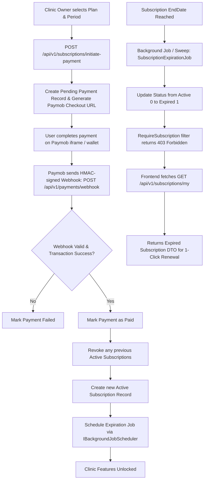
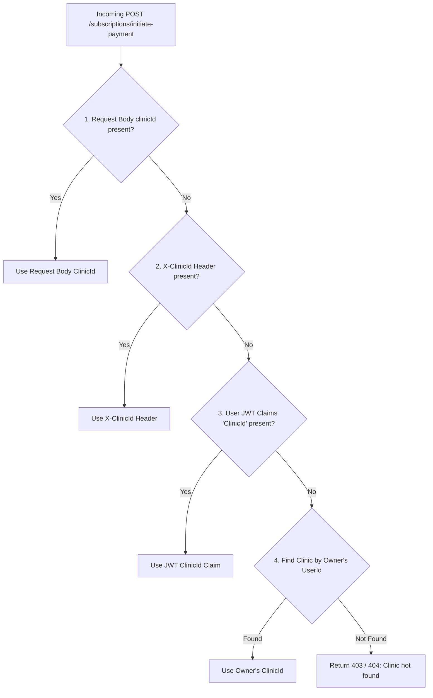

# 📋 Backend Specifications: Subscription Renewal, Expiration & Plan Management Flow

## 1. Overview
This document specifies the backend architecture, API contracts, Paymob payment integration, background job execution, and permission gating for clinic subscription management, renewal, expiration handling, and plan administration in **ClinicHub**.

---

## 2. Subscription Lifecycle & Flow Architecture



---

## 3. Critical Backend Conventions & Resolution Rules

### 3.1. Clinic Resolution Priority for Payment Initiation
When a clinic owner initiates subscription payment (especially for an expired account or before clinic claims are reissued), the backend resolves the target clinic using the following priority fallback:



1. **Resolution Sequence**:
   - Check `request.ClinicId` in JSON payload (if provided).
   - Check `X-ClinicId` HTTP request header.
   - Check `ClinicId` claim in Bearer JWT token (`_currentUser.CurrentClinicId`).
   - Query the database for the active clinic owned by the authenticated `UserId` (`UserRole.ClinicOwner`).

---

### 3.2. Handling `GET /api/v1/subscriptions/my` for Expired Subscriptions
- **Behavior**:
  - If a clinic has an active, expired, or cancelled subscription, the endpoint returns **`HTTP 200 OK`** with the latest `SubscriptionDto`.
  - When expired: `isActive = false`, `status = 1` (`SubscriptionStatus.Expired`).
  - When cancelled: `isActive = false`, `status = 2` (`SubscriptionStatus.Cancelled`).
  - Includes nested plan information (`planId`, `planName`, `period`, `amount`, `startDate`, `endDate`, `permissions`).
  - Returning the expired subscription details allows the frontend to show current plan metadata and facilitate seamless **one-click renewal**.
  - Returns `200 OK` with `data: null` only if the clinic has never had any subscription record in the database.

---

### 3.3. Webhook & Renewal Activation Flow
Upon receiving a verified Paymob transaction webhook (`POST /api/v1/payments/webhook`):
1. **HMAC Validation**: Webhook payload is cryptographically verified using Paymob HMAC key.
2. **Find Payment**: Finds the pending `Payment` record by `PaymobOrderId`.
3. **Handle Previous Subscriptions**: Any currently active subscriptions for the clinic are updated to `Status = SubscriptionStatus.Revoked (3)` with a reason note.
4. **Create Subscription**: Creates a new `Subscription` record:
   - `ClinicId = payment.ClinicId`
   - `PlanId = payment.PlanId`
   - `Period = payment.SubscriptionPeriod` (0 = Monthly, 1 = Yearly)
   - `StartDate = DateTime.Now`
   - `EndDate = Period == Yearly ? StartDate.AddYears(1) : StartDate.AddMonths(1)`
   - `Amount = payment.Amount`
   - `Status = SubscriptionStatus.Active (0)`
   - `PaidAt = DateTime.Now`
   - `PaymentId = payment.Id`
5. **Schedule Expiration**: Registers a background expiration job for the exact `EndDate` via `IBackgroundJobScheduler.ScheduleSubscriptionExpirationAsync`.

---

## 4. Enums & Single Source of Truth

### 4.1. `SubscriptionStatus`
Defined in `ClinicHub.Domain.Enums.SubscriptionStatus`:

| Value | Enum Name | Description (AR) | UI / Feature Access |
|---|---|---|---|
| `0` | **Active** | نشط | Full access according to plan permissions |
| `1` | **Expired** | منتهي الصلاحية | Blocked by `[RequireSubscription]`; renewal prompt |
| `2` | **Cancelled** | ملغي من قبل المستخدم | Blocked by `[RequireSubscription]`; renewal prompt |
| `3` | **Revoked** | ملغي من قبل الإدارة | Revoked/refunded by super admin |

> ⚠️ **Important**: In the domain model, `Expired = 1` and `Cancelled = 2`.

---

### 4.2. `SubscriptionPlan` (Billing Period)
Defined in `ClinicHub.Domain.Enums.SubscriptionPlan`:

| Value | Enum Name | Billing Cycle | Duration Added |
|---|---|---|---|
| `0` | **Monthly** | شهري | 1 Month (`StartDate.AddMonths(1)`) |
| `1` | **Yearly** | سنوي | 1 Year (`StartDate.AddYears(1)`) |

---

### 4.3. `SubscriptionPermission` (Bit Flags)
Defined in `ClinicHub.Domain.Enums.SubscriptionPermission`:

| Value | Permission Flag | Description |
|---|---|---|
| `0` | `None` | No specific feature permission |
| `1` | `ManageAppointments` | Booking, schedule, and appointment management |
| `2` | `PatientRecords` | Access to electronic medical records (EMR) |
| `4` | `BasicReports` | Basic clinic dashboard reporting |
| `8` | `AdvancedReports` | Financial and advanced analytical reporting |
| `16` | `MarketingTools` | Marketing campaigns & promotional tools |
| `64` | `ManageStaff` | Clinic staff member management |
| `128` | `ManageDoctors` | Clinic doctor profile & schedule management |
| `256` | `OnlineBooking` | Public online booking enablement |
| `~0` | `All` | All system permissions granted |

---

## 5. API Endpoints Reference

### Summary Matrix

| Method | Endpoint | Roles / Auth | Description |
|---|---|---|---|
| `GET` | `/api/v1/plans` | `[AllowAnonymous]` | List all active public plans with pricing & permissions |
| `GET` | `/api/v1/subscriptions/my` | `ClinicOwner`, `Doctor`, `Staff` | Get current/latest clinic subscription |
| `POST` | `/api/v1/subscriptions/initiate-payment` | `ClinicOwner` | Initiate Paymob payment for plan renewal/upgrade |
| `POST` | `/api/v1/subscriptions/my/cancel` | `ClinicOwner` | Cancel current active subscription |
| `GET` | `/api/v1/admin/plans` | `SuperAdmin` | List all plans (active & inactive) |
| `POST` | `/api/v1/admin/plans` | `SuperAdmin` | Create a new subscription plan |
| `PUT` | `/api/v1/admin/plans/{id}` | `SuperAdmin` | Update existing plan details |
| `DELETE` | `/api/v1/admin/plans/{id}` | `SuperAdmin` | Soft-delete a plan |
| `GET` | `/api/v1/admin/dashboard/subscriptions` | `SuperAdmin` | Paginated list of all clinic subscriptions |
| `POST` | `/api/v1/admin/dashboard/subscriptions` | `SuperAdmin` | Manually grant/create subscription for a clinic |
| `POST` | `/api/v1/admin/dashboard/subscriptions/{id}/revoke` | `SuperAdmin` | Revoke a subscription and trigger refund if eligible |
| `POST` | `/api/v1/payments/webhook` | `[AllowAnonymous]` (HMAC Validated) | Paymob payment confirmation webhook |

---

## 6. Detailed API Contracts

### 6.1. Get Active Plans
- **Endpoint**: `GET /api/v1/plans`
- **Authentication**: Anonymous (`[AllowAnonymous]`)

#### Successful Response (`200 OK`):
```json
{
  "success": true,
  "data": [
    {
      "id": "3fa85f64-5717-4562-b3fc-2c963f66afa6",
      "name": "Professional Plan",
      "nameAr": "الباقة الاحترافية",
      "description": "Comprehensive clinic management suite",
      "descriptionAr": "باقة شاملة لإدارة العيادة والأطباء والتقارير",
      "priceMonthly": 500.00,
      "priceYearly": 5000.00,
      "maxDoctors": 5,
      "maxStaff": 10,
      "features": "Online Booking, EMR, Advanced Reports",
      "isActive": true,
      "sortOrder": 1,
      "permissions": [
        "ManageAppointments",
        "PatientRecords",
        "BasicReports",
        "AdvancedReports",
        "ManageStaff",
        "ManageDoctors",
        "OnlineBooking"
      ]
    }
  ],
  "message": null,
  "statusCode": 200
}
```

---

### 6.2. Initiate Subscription Payment
- **Endpoint**: `POST /api/v1/subscriptions/initiate-payment`
- **Authentication**: `Bearer <token>` (Role: `ClinicOwner`)
- **Headers**:
  - `Content-Type`: `application/json`
  - `X-ClinicId`: `<Guid>` *(Optional)*
  - `Accept-Language`: `ar` or `en`

#### Request Payload:
```json
{
  "planId": "3fa85f64-5717-4562-b3fc-2c963f66afa6",
  "period": 0,
  "returnUrl": "https://clinichub.example.com/Home/PaymentResult"
}
```

#### Fields Description:
| Field | Type | Required | Description |
|---|---|---|---|
| `planId` | `Guid` | Yes | ID of the target active plan. |
| `period` | `int` | Yes | `0` = Monthly, `1` = Yearly (`SubscriptionPlan`). |
| `returnUrl` | `string?` | Optional | Paymob redirect return URL after checkout. |

#### Successful Response (`200 OK`):
```json
{
  "success": true,
  "data": {
    "paymentId": "7ca85f64-5717-4562-b3fc-2c963f66afc8",
    "paymobRedirectUrl": "https://accept.paymob.com/api/acceptance/iframes/...",
    "redirectUrl": "https://accept.paymob.com/api/acceptance/iframes/...",
    "paymentUrl": "https://accept.paymob.com/api/acceptance/iframes/...",
    "url": "https://accept.paymob.com/api/acceptance/iframes/...",
    "paymobPaymentKey": "ZXlKaGJHY2lPaUpTVXpVeE1pSXNJblI1Y0NJNklrcF...",
    "planId": "3fa85f64-5717-4562-b3fc-2c963f66afa6",
    "planName": "الباقة الاحترافية",
    "period": 0,
    "amount": 500.00,
    "currency": "EGP"
  },
  "message": null,
  "statusCode": 200
}
```

---

### 6.3. Get My Clinic Subscription
- **Endpoint**: `GET /api/v1/subscriptions/my`
- **Authentication**: `Bearer <token>` (Role: `ClinicOwner`, `Doctor`, `Staff`)
- **Headers**:
  - `X-ClinicId`: `<Guid>` *(Optional)*

#### Successful Response (`200 OK` — Active Subscription):
```json
{
  "success": true,
  "data": {
    "id": "1ea85f64-5717-4562-b3fc-2c963f66afd9",
    "clinicId": "4ba85f64-5717-4562-b3fc-2c963f66afb7",
    "clinicName": "عيادة النخبة التخصصية",
    "planId": "3fa85f64-5717-4562-b3fc-2c963f66afa6",
    "planName": "الباقة الاحترافية",
    "period": 0,
    "startDate": "2026-08-01T00:00:00Z",
    "endDate": "2026-09-01T00:00:00Z",
    "status": 0,
    "amount": 500.00,
    "paidAt": "2026-08-01T10:15:30Z",
    "isActive": true,
    "permissions": [
      "ManageAppointments",
      "PatientRecords",
      "BasicReports",
      "AdvancedReports",
      "ManageStaff",
      "ManageDoctors",
      "OnlineBooking"
    ]
  },
  "message": null,
  "statusCode": 200
}
```

#### Successful Response (`200 OK` — Expired Subscription):
```json
{
  "success": true,
  "data": {
    "id": "1ea85f64-5717-4562-b3fc-2c963f66afd9",
    "clinicId": "4ba85f64-5717-4562-b3fc-2c963f66afb7",
    "clinicName": "عيادة النخبة التخصصية",
    "planId": "3fa85f64-5717-4562-b3fc-2c963f66afa6",
    "planName": "الباقة الاحترافية",
    "period": 0,
    "startDate": "2026-07-01T00:00:00Z",
    "endDate": "2026-08-01T00:00:00Z",
    "status": 1,
    "amount": 500.00,
    "paidAt": "2026-07-01T10:15:30Z",
    "isActive": false,
    "permissions": [
      "ManageAppointments",
      "PatientRecords",
      "BasicReports",
      "AdvancedReports",
      "ManageStaff",
      "ManageDoctors",
      "OnlineBooking"
    ]
  },
  "message": null,
  "statusCode": 200
}
```

---

### 6.4. Cancel Current Subscription
- **Endpoint**: `POST /api/v1/subscriptions/my/cancel`
- **Authentication**: `Bearer <token>` (Role: `ClinicOwner`)

#### Successful Response (`200 OK`):
```json
{
  "success": true,
  "data": true,
  "message": null,
  "statusCode": 200
}
```

---

### 6.5. Super Admin: List All Subscriptions
- **Endpoint**: `GET /api/v1/admin/dashboard/subscriptions?PageNumber=1&PageSize=20&Status=0`
- **Authentication**: `Bearer <token>` (Role: `SuperAdmin`)
- **Query Parameters**:
  - `PageNumber` (`int`, default: `1`)
  - `PageSize` (`int`, default: `10`)
  - `Status` (`int?` — 0: Active, 1: Expired, 2: Cancelled, 3: Revoked)
  - `PlanId` (`Guid?`)
  - `ClinicId` (`Guid?`)

#### Successful Response (`200 OK`):
```json
{
  "success": true,
  "data": {
    "items": [
      {
        "id": "1ea85f64-5717-4562-b3fc-2c963f66afd9",
        "clinicId": "4ba85f64-5717-4562-b3fc-2c963f66afb7",
        "clinicName": "عيادة الشفاء",
        "planId": "3fa85f64-5717-4562-b3fc-2c963f66afa6",
        "planName": "الباقة الاحترافية",
        "period": 1,
        "startDate": "2026-01-01T00:00:00Z",
        "endDate": "2027-01-01T00:00:00Z",
        "status": 0,
        "amount": 5000.00,
        "paidAt": "2026-01-01T12:00:00Z",
        "isActive": true,
        "permissions": ["ManageAppointments", "PatientRecords", "BasicReports", "OnlineBooking"]
      }
    ],
    "pageNumber": 1,
    "pageSize": 20,
    "totalCount": 1,
    "totalPages": 1,
    "hasPreviousPage": false,
    "hasNextPage": false
  },
  "message": null,
  "statusCode": 200
}
```

---

### 6.6. Super Admin: Grant Manual Subscription
- **Endpoint**: `POST /api/v1/admin/dashboard/subscriptions`
- **Authentication**: `Bearer <token>` (Role: `SuperAdmin`)

#### Request Payload:
```json
{
  "clinicId": "4ba85f64-5717-4562-b3fc-2c963f66afb7",
  "planId": "3fa85f64-5717-4562-b3fc-2c963f66afa6",
  "period": 1,
  "startDate": "2026-08-19T00:00:00Z",
  "amount": 0.00
}
```

#### Successful Response (`201 Created`):
```json
{
  "success": true,
  "data": {
    "id": "2fa85f64-5717-4562-b3fc-2c963f66afe0",
    "clinicId": "4ba85f64-5717-4562-b3fc-2c963f66afb7",
    "clinicName": "عيادة الشفاء",
    "planId": "3fa85f64-5717-4562-b3fc-2c963f66afa6",
    "planName": "الباقة الاحترافية",
    "period": 1,
    "startDate": "2026-08-19T00:00:00Z",
    "endDate": "2027-08-19T00:00:00Z",
    "status": 0,
    "amount": 0.00,
    "paidAt": "2026-08-19T00:37:00Z",
    "isActive": true,
    "permissions": ["ManageAppointments", "PatientRecords", "BasicReports"]
  },
  "message": "تم إنشاء الاشتراك بنجاح",
  "statusCode": 201
}
```

---

### 6.7. Super Admin: Revoke Subscription
- **Endpoint**: `POST /api/v1/admin/dashboard/subscriptions/{id}/revoke`
- **Authentication**: `Bearer <token>` (Role: `SuperAdmin`)

#### Successful Response (`200 OK`):
```json
{
  "success": true,
  "data": true,
  "message": null,
  "statusCode": 200
}
```

---

## 7. Feature Access Control & Filters

The backend protects endpoints using two specialized authorization action filters:

### 7.1. `[RequireSubscription]`
- Applied at the Controller or Action level.
- Verifies that the current clinic has a valid record where:
  $$\text{Status} == \text{SubscriptionStatus.Active} \quad \land \quad \text{EndDate} > \text{DateTime.Now}$$
- If expired, missing, or revoked, immediately aborts with:
  ```json
  {
    "success": false,
    "data": null,
    "message": "Active subscription required to access this feature.",
    "errors": [],
    "statusCode": 403
  }
  ```

### 7.2. `[RequirePlanPermission(SubscriptionPermission.X)]`
- Checks whether the clinic's active plan includes the required permission flag (e.g. `SubscriptionPermission.AdvancedReports`, `SubscriptionPermission.ManageStaff`).
- If the plan lacks this feature, returns:
  ```json
  {
    "success": false,
    "data": null,
    "message": "Your current plan does not include this feature. Please upgrade to access it.",
    "errors": [],
    "statusCode": 403
  }
  ```

---

## 8. Background Jobs & Automation

1. **`SubscriptionExpirationJob.ExpireAsync(subscriptionId)`**:
   - Executes at exact `EndDate` scheduled via `IBackgroundJobScheduler`.
   - Checks if `Status == SubscriptionStatus.Active` and `EndDate <= DateTime.Now`.
   - Flips status to `SubscriptionStatus.Expired (1)`.

2. **`SubscriptionExpirationJob.SweepExpiredAsync()`**:
   - Recurring maintenance job (runs periodically).
   - Scans all `SubscriptionStatus.Active` records where `EndDate <= DateTime.Now`.
   - Batch updates expired subscriptions to `SubscriptionStatus.Expired (1)` to ensure no active state leaks if an ad-hoc job failed or was delayed.

---

## 9. Standard API Response & Error Envelope

All API responses follow the consistent ClinicHub envelope format:

### Success Envelope (`ApiResponse<T>`)
```json
{
  "success": true,
  "data": { ... },
  "message": "نص الرسالة إن وجد أو null",
  "statusCode": 200
}
```

### Business / Validation Error Envelope
```json
{
  "success": false,
  "data": null,
  "message": "نص رسالة الخطأ المترجمة",
  "errors": [
    "حقل الخطة مطلوب",
    "القيمة المحددة غير صالحة"
  ],
  "statusCode": 400
}
```

