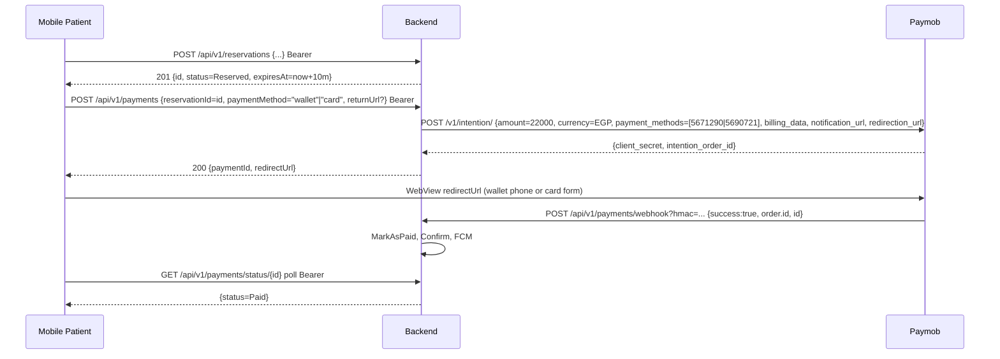

# Mobile Integration — Appointment Payments (Online) + Ads View

> **For:** Patient mobile app (Android / iOS) + optional clinic owner mobile
> **Backend:** `E:\ClinicHub` ASP.NET Core 10 • MediatR CQRS • Paymob Intention API UnifiedCheckout (`ClinicHub.Infrastructure/Services/Paymob/PaymobService.cs:16`)
> **Date:** 2026-08-28 — **Branch:** `fix/push-main-block` (`142bc7f` mapper fix + `fc26ce6` docs + `5167292` Paymob diagnostics)
> **Related docs:** `appointment-payment-mobile-workflow.md`, `ADS_MOBILE_GUIDE.md`, `paymob-integration-mapping.md`, `ADS_FRONTEND.md`

---

## 1. Logic Changes in This Release (what mobile must know)

### 1.1 Ads — now independent from subscriptions

| Before | After | Code |
|---|---|---|
| Clinic needed **active Premium/Enterprise subscription** to buy ads (`IsEligibleForAdsAsync` checked `subscription.Status==Active`) | Only needs **clinic exists + `Clinic.Status==Active`** | `ClinicHub.Application/Features/Ads/AdsOrderProcessor.cs:123` now `return clinic != null && clinic.Status==Active` |
| Ads blocked when subscription expired | Marketing + ad-payment pages stay accessible even without active plan | `ClinicHub-Frontend/Clinic/ClinicController.cs:112`/`128` `isSubscriptionAction` + `isAdsAction` |
| Payment method not exposed to frontend | `PaymentMethod` (`wallet`/`card`) added to ads order | `ClinicHub.Application/Features/Ads/AdsOrderProcessor.cs:72` `PaymentMethodMapper.ToEnum(paymentMethod)` → `InitiateCheckoutPaymentAsync` vs `InitiateWalletPaymentAsync` |

**Payment flow for ads (clinic owner via web, not patient mobile):**
`POST /api/v1/clinics/{clinicId}/ads/orders` `AdPackageId + DurationDays + LogoImageUrl? + PaymentMethod? + ReturnUrl?` → `Advertisement Status=0 PendingPayment` + `Payment Status=Processing` + `PaymobRedirectUrl` → user pays at Paymob UnifiedCheckout → webhook `POST /api/v1/payments/webhook` validates HMAC SHA512 (`PaymobService.cs:196`) → `Payment.MarkAsPaid` → `Advertisement Status=1 Active` `StartDate=now` `EndDate=now+DurationDays`. **Only webhook (or admin cash) flips 0→1**, no polling endpoint.

**Mobile impact:** **none** — mobile never creates ads. Mobile only **reads** active ads via `GET /api/v1/public/ads/active` (see §3). Polling via `GET /public/ads/active` on app open / pull-to-refresh is enough; ads auto-expire when `endDate` passes.

### 1.2 Payment — credit (card) + wallet via Paymob — fixes

| Area | Before | After | File |
|---|---|---|---|
| `POST /api/v1/payments/initiate` (generic) | hardcoded `InitiateWalletPaymentAsync` (wallet only) | `paymentMethod` body field → wallet **or** card | `ClinicHub.Application/Features/Payment/Commands/InitiatePayment/InitiatePaymentCommand.cs:6` + `InitiatePaymentCommandHandler.cs:63` |
| `POST /api/v1/payments` (booking/reservation `Reserved`) | hardcoded `InitiateCheckoutPaymentAsync` (card only) | `paymentMethod` + `returnUrl` → wallet or card, omitted → card (legacy) | `InitiateBookingPaymentCommand.cs:8` + `InitiateBookingPaymentCommandHandler.cs:65` |
| Clinic accept `PUT /appointments/{id}/accept` | hardcoded card | `?paymentMethod=wallet|card&returnUrl=` query **or** JSON body; falls back to card | `AppointmentsController.cs:123` + `AppointmentAcceptanceService.cs:41` |
| `PaymentMethodMapper` | `paymob_card` only with `_`, frontend sends `PaymobCreditCard` (no `_`) → fell to default wallet → **both credit+wallet redirected to wallet page** | Added `paymobcreditcard`, `paymob_creditcard` variants | `ClinicHub.Application/Features/AdminPayments/PaymentMethodMapper.cs:15` fixed `142bc7f` |
| `PaymobSettings` IDs swapped | `IntegrationId=5690721` was **wallet** per dashboard `Prompts/prompt.txt:1` `محفظة`, `WalletIntegrationId=5690722` invalid `404` | Corrected to `IntegrationId=5671290` card `بطاقة ائتمان` `VPC/MIGS`, `WalletIntegrationId=5690721` wallet `UIG` (both `201` in live test) | `ClinicHub.API/appsettings.Development.json:227-228` `Test.json:215-216` (gitignored) + `docs/paymob-integration-mapping.md` |
| `PaymobService` error handling | `BadRequestException` generic, `int.Parse` crashed on placeholder `YOUR_...` | `ResolveIntegrationId` safe `TryParse` + `ILogger` + surfaces Paymob `detail` (`Integration ID does not exist`) | `ClinicHub.Infrastructure/Services/Paymob/PaymobService.cs:34,182` `5167292` |

**Enums** `ClinicHub.Domain/Enums/PaymentMethod.cs:3` `Cash=0, PaymobWallet=1, PaymobCreditCard=2` stored as `Payment.PaymentMethod` string `cash`/`paymob_wallet`/`paymob_card` (`PaymentMethodMapper.cs:21` `ToDbString`). `PaymentStatus.cs:3` `Pending=0,Paid=1,Failed=2,Refunded=3,Processing=4`.

**Pricing:** `BookingConfiguration.cs:7` per clinic `ConsultationFee` + `PlatformSetting.AppointmentFeePercent` → `AppointmentPricingCalculator.cs:10` `total = fee + round(fee*percent/100)`. Patient pays total; clinic keeps fee. Currency `EGP`, Paymob receives `amount*100` cents.

---

## 2. Mobile Roles & What to Integrate

| Role | Appointment Payments | Ads |
|---|---|---|
| **Patient** (mobile) | **Must** integrate: create reservation → pay (`wallet`/`card`) → poll status → view `my` appointments | **Must** integrate: `GET /public/ads/active` to display clinic ads carousel/badge |
| **Clinic owner** | Web dashboard `E:\ClinicHub-Frontend` does `PUT /appointments/{id}/accept` to generate payment link (mobile patient receives FCM with `paymentUrl`). Mobile clinic owner could also call same endpoint if building owner app. | Web dashboard `POST /clinics/{clinicId}/ads/orders` to buy ads — not needed in patient mobile. |
| **Doctor/Staff** | Approve/accept with `paymentMethod` similarly | No |

**Patient mobile does NOT call:** `/payments/webhook` (Paymob → backend only), `/admin/*`, subscription `POST /subscriptions/initiate-payment` (clinic owner web only, unless owner mobile).

---

## 3. Ads View in Mobile — The Only Endpoint You Need

### `GET /api/v1/public/ads/active`

`ClinicHub.API/Routes/ApiRoutes.cs:344` `PublicAds.Active` — `AllowAnonymous`

**Request:** none (optional `Accept-Language: ar` for errors)

**Response** `ApiResponse<List<PublicAdDto>>`:
```json
{
  "isSuccess": true,
  "data": [
    {
      "id": "5f2c0000-0000-0000-0000-000000000002",
      "clinicId": "2d1a0000-0000-0000-0000-000000000003",
      "clinicName": "مركز القلب التخصصي",
      "clinicLogoUrl": null,
      "imageUrl": "clinic-logo-8f3a.png",
      "packageId": "3f9a0000-0000-0000-0000-000000000001",
      "packageNameAr": "شريط مميز",
      "title": null,
      "startDate": "2026-08-05T00:00:00",
      "endDate": "2026-08-19T00:00:00"
    }
  ],
  "errors": []
}
```

| Field | Type | Notes |
|---|---|---|
| `clinicLogoUrl` | `string\|null` | clinic profile logo — relative path |
| `imageUrl` | `string\|null` | **ad logo** uploaded for this ad — relative path; `null` when none |
| `startDate`/`endDate` | ISO datetime | `endDate` = expiry, backend auto-excludes expired |

**Image URL:** `{base}/files/{imageUrl}` e.g. `https://api.clinichub.com/files/clinic-logo-8f3a.png` (`CustomFileProvider` at `/files`).

**Rendering (required contract) — see `ADS_MOBILE_GUIDE.md:77`:**
```
if imageUrl != null:
  Image(src="{base}/files/{imageUrl}", fallback=clinicName)
else:
  TextBadge { clinicName, packageNameAr, startDate→endDate }
Tag: "نشط"
Tap → navigate to clinic `clinicId`
```

**Refresh:** on app open + clinic list focus (pull-to-refresh). No push for ads. Empty list = no active ads.

**Kotlin/Swift model (`ADS_MOBILE_GUIDE.md:98`):**
```kotlin
data class PublicAd(
  val id:String, val clinicId:String, val clinicName:String?,
  val clinicLogoUrl:String?, val imageUrl:String?,
  val packageId:String, val packageNameAr:String?, val title:String?,
  val startDate:String, val endDate:String
)
```
Mark `imageUrl` **nullable** or serialization crashes.

**What mobile does NOT do for ads:** no create, no upload, no payment — all on web dashboard (`Marketing.cshtml:514` `POST /Clinic/CreateAdOrder` → Paymob UnifiedCheckout).

---

## 4. Appointment Payments Online — Mobile Flow & Endpoints

### 4.1 Routes summary (`ApiRoutes.cs:136`)

| Purpose | Method | Route | Auth | Request → Response |
|---|---|---|---|---|
| **A. Create reservation** (patient books slot) | `POST` | `ApiRoutes.Reservations.Create` `POST /api/v1/reservations` | `Bearer` | `CreateReservationCommand` → `201 AppointmentDto` (`Reserved` + `expiresAt`) |
| **B. Pay reserved** (new booking) | `POST` | `ApiRoutes.Payments.CreateBooking` `POST /api/v1/payments` | `Bearer` `BookedByUserId` | `InitiateBookingPaymentCommand` → `200 BookingPaymentResponseDto` with `redirectUrl` |
| **C. Pay generic** (Pending/Reserved/Accepted) | `POST` | `ApiRoutes.Payments.Initiate` `POST /api/v1/payments/initiate` | `Bearer` | `InitiatePaymentCommand` → `200 InitiatePaymentResponseDto` |
| **D. Poll status** (fallback) | `GET` | `ApiRoutes.Payments.GetStatus` `GET /api/v1/payments/status/{appointmentId}` | `Bearer` owner | `PaymentStatusDto` |
| **E. Manual verify** | `POST` | `ApiRoutes.Payments.VerifyBooking` `POST /api/v1/payments/verify` | `Bearer` | `{paymentId, transactionId}` → `BookingPaymentResponseDto` |
| **F. My appointments** (list with payment) | `GET` | `ApiRoutes.Appointments.My` `GET /api/v1/appointments/my?PageNumber=1&PageSize=20` | `Bearer` | `PagginatedResult<MyAppointmentDto>` |
| **G. Slots** (before booking) | `GET` | `ApiRoutes.Slots.GetByDoctor` `GET /api/v1/clinics/{clinicId}/doctors/{doctorId}/slots?date=YYYY-MM-DD` | `Bearer` | `GetAvailableSlotsResponse` |
| **H. Webhook** | `POST` | `ApiRoutes.Payments.Webhook` `POST /api/v1/payments/webhook?hmac=...` | `AllowAnonymous` HMAC | Paymob → backend only, mobile never calls |

**Other clinic-side (if owner mobile):** `PUT /api/v1/appointments/{id}/accept?paymentMethod=wallet|card&returnUrl=` (`AppointmentsController.cs:123`), `PUT /staff/appointments/{id}/approve`, `PUT /doctors/appointments/{id}/accept`, `PUT /doctors/appointments/{id}/status {status:6,paymentMethod,returnUrl}`.

Headers every call: `Authorization: Bearer <jwt>`, `Content-Type: application/json`, `Accept-Language: ar`.

### 4.2 A. Create reservation — `POST /api/v1/reservations`

**When `BookingConfiguration.ConsultationFee >0` → `Status=Reserved` `ExpiresAt=now+ReservationTtlMinutes` (default 10) else `Pending`. Hangfire expires → `Cancelled`.**

**Request** `CreateReservationCommand` (example):
```json
{
  "clinicId": "guid",
  "doctorId": "guid",
  "slotId": "guid",
  "date": "2026-08-30",
  "startTime": "10:00:00",
  "endTime": "10:30:00",
  "patientName": "Ahmed Ali",
  "patientPhone": "01000000000",
  "notes": "headache"
}
```
Minimal required: `clinicId`, `doctorId`, `date`, `startTime`, `endTime` (varies by validator). See `ReservationsController` / `CreateReservationCommandValidator`.

**Response** `201` `AppointmentDto`:
```json
{
  "id": "apt-guid",
  "status": "Reserved",
  "expiresAt": "2026-08-28T14:40:00Z",
  "amount": 200,
  "currency": "EGP",
  "paymentId": null,
  "paymentUrl": null
}
```
If `Reserved`, **must** pay via **B** within `expiresAt` else `409 ReservationExpired` and re-book new slot.

### 4.3 B. Pay reserved — `POST /api/v1/payments`

**New fields `paymentMethod` + `returnUrl` (backward compat: omitted → card).**

**Request** `InitiateBookingPaymentCommand`:
```json
{
  "reservationId": "apt-guid from A",
  "paymentMethod": "wallet",
  "returnUrl": "myapp://payment-result"
}
```
`paymentMethod` values (case-insensitive, `PaymentMethodMapper.cs:15` fixed `142bc7f`):
- `"wallet"` | `"paymob_wallet"` | `"paymob"` | `"paymobwallet"` | `"PaymobWallet"` → `PaymobWallet` (Vodafone Cash etc.) → `PaymobService.cs:59` `IntegrationId=wallet` (`5690721` wallet `UIG`)
- `"card"` | `"creditcard"` | `"credit_card"` | `"paymob_card"` | `"PaymobCreditCard"` | `"visa"` | `"mastercard"` → `PaymobCreditCard` → `IntegrationId=card` (`5671290` `VPC/MIGS`)

`returnUrl` overrides `PaymobSettings.RedirectionUrl` for this intention only (optional, use deep link `myapp://payment-result?success=...` or `https://yourdomain/go/payment-result`).

**Response** `200` `BookingPaymentResponseDto` (`ClinicHub.Application/Features/Payment/DTOs/BookingPaymentResponseDto.cs:5`):
```json
{
  "paymentId": "pay-guid",
  "reservationId": "apt-guid",
  "amount": 220.00,
  "currency": "EGP",
  "status": 4,
  "transactionId": null,
  "redirectUrl": "https://accept.paymob.com/unifiedcheckout/?publicKey=egy_pk_test_...&clientSecret=xxx",
  "failureReason": null,
  "createdAt": "2026-08-28T14:30:00Z"
}
```
`status=4 Processing` → webhook flips to `1 Paid`. `amount = ConsultationFee + platformFee` (`AppointmentPricingCalculator.cs:10`) EGP, Paymob receives `amount*100` cents. `redirectUrl` is **Paymob UnifiedCheckout URL** — open in `WebView`/`CustomTabs` (see §5). Do **not** construct URL client-side; `publicKey` is injected server-side.

**Errors:** `404 ReservationNotFound`, `403 ReservationExpired`, `400 AppointmentNotPending` (status != `Reserved`), `400 AlreadyPaid`, `400 BookingConfigNotFound`, `400 PaymobOrderFailed: Integration ID does not exist` (now surfaces detail via `PaymobService.cs:182`).

### 4.4 C. Pay generic — `POST /api/v1/payments/initiate`

For `Pending`/`Reserved`/`Accepted` (when clinic already accepted and generated link, or patient retry).

**Request** `InitiatePaymentCommand`:
```json
{
  "appointmentId": "apt-guid",
  "paymentMethod": "card",
  "returnUrl": "myapp://payment-result"
}
```
Values same as B but **omitted → wallet** (old mobile builds via this route sent no method via this route, kept wallet default).

**Response** `200` `InitiatePaymentResponseDto`:
```json
{
  "paymentId": "pay-guid",
  "paymentKey": "client_secret_from_paymob",
  "redirectUrl": "https://accept.paymob.com/unifiedcheckout/?publicKey=...&clientSecret=..."
}
```
Stored `Payment.PaymentMethod = paymob_wallet|paymob_card`, `Status=Processing`.

**Errors:** `404 AppointmentNotFound`, `401 Unauthorized` (not `BookedByUserId`), `400 AppointmentNotPending`, `400 AlreadyPaid`, `400 BookingConfigNotFound`.

### 4.5 D. Poll status — `GET /api/v1/payments/status/{appointmentId}`

**Response** `PaymentStatusDto`:
```json
{
  "paymentId": "pay-guid",
  "appointmentId": "apt-guid",
  "status": 0,
  "amount": 220.00,
  "paidAt": null,
  "transactionId": null
}
```
`status` enum §1.2. No `redirectUrl` here; use `GET /appointments/my` for `paymobRedirectUrl`.

After WebView closes, poll every `3s` up to `60s` until `Paid`. Then `GET /appointments/my` will return `status=Confirmed`.

### 4.6 E. Manual verify — `POST /api/v1/payments/verify`

**Request:**
```json
{ "paymentId": "pay-guid", "transactionId": "paymob_tx_or_cash_ref" }
```
If `Processing|Pending` → `MarkAsPaid` → `appointment.Confirm` → `BookingPaymentResponseDto` with `Status=Paid`. If already `Paid` → returns current. If `Failed` → `PaymentFailed`.

### 4.7 F. My appointments — `GET /api/v1/appointments/my`

`PagginatedResult<MyAppointmentDto>` (`MyAppointmentDto.cs:8`):
```json
{
  "id": "apt-guid",
  "clinicId": "guid", "clinicName": "Al-Noor",
  "doctorId": "guid", "doctorName": "Dr. Samir",
  "date": "2026-08-30", "startTime": "10:00", "endTime": "10:30",
  "status": "Accepted",
  "rejectionReason": null,
  "payment": {
    "paymentId": "pay-guid",
    "amount": 220.00,
    "currency": "EGP",
    "paymentStatus": 0,
    "paymobRedirectUrl": "https://accept.paymob.com/unifiedcheckout/?publicKey=...&clientSecret=..."
  }
}
```
`paymobRedirectUrl` present only while `Accepted` & unpaid → show “Pay now” button.

---

## 5. Mobile WebView & Deep Link Handling

1. Call **B** or **C** → get `redirectUrl` (or `paymobRedirectUrl` from **F**).
2. Open Paymob **UnifiedCheckout** in `WebView` (`WKWebView`/`WebView`/`CustomTabs`):
   ```
   https://accept.paymob.com/unifiedcheckout/?publicKey=<PaymobSettings.PublicKey>&clientSecret=<paymentKey>
   ```
   `clientSecret` is `paymentKey` from response; **do not** build URL client-side.
3. Paymob shows **wallet** (phone input) vs **card** (pan/expiry/cvv) per `payment_methods=[IntegrationId]` (wallet `5690721` UIG vs card `5671290` MIGS — now corrected per dashboard `Prompts/prompt.txt:1-2`).
4. Intercept navigation:
   - `success=true` → close WebView, treat as pending success, poll **D**.
   - `success=false` → show retry (re-initiate **B**/**C** with same `appointmentId` + new `paymentMethod`).
5. **Never trust client success** — server webhook is truth. `PaymobSettings.WebhookUrl` (`appsettings.*.json`) must point to `POST /api/v1/payments/webhook?hmac=...` (`PaymentsController.cs:88`).

**Webhook (Paymob → backend, mobile never calls):** validates `HMACSHA512(HmacSecret, 19 fields)` (`PaymobService.cs:196`), idempotent skip if `Paid|Refunded`, `success:true` → `MarkAsPaid` → `Confirm` → FCM `PaymentConfirmation` (patient) + `PaymentReceived` (owner) + `RevenueIncreased` (superadmin) → schedule `CancellationWindowClose` + `NoShowMarking`.

**DeepLink:** `RedirectionUrl`/`returnUrl` can be `myapp://payment-result?success=...` via `DeepLinkRoutes.cs` or `https://yourdomain/go/payment-result`. Backend `GET /payments/result?success=...` redirects to `/payment/result.html`.

---

## 6. End-to-End Sequences for Mobile

### Flow A — Patient Reserved → Pay



### Flow B — Clinic Accepted (patient sees Pay button)

`Mobile` → `POST /reservations` → `201 Pending/Reserved` → Clinic dashboard `PUT /appointments/{id}/accept?paymentMethod=card` → Backend creates `Payment Processing` + `Appointment Accepted` → FCM `AppointmentConfirmation {paymentUrl}` → Mobile shows Pay button with `payment.payment.paymobRedirectUrl` from `GET /appointments/my` → same WebView → webhook → `Confirmed`.

### Re-try / Expiry

- `409 ReservationExpired` (after `expiresAt`) → re-book new slot (`GET /clinics/{clinicId}/doctors/{doctorId}/slots?date=...` → `POST /reservations` again)
- `Failed` → same `POST /payments` or `POST /payments/initiate` with same `appointmentId` creates new `PaymobOrderId` + `redirectUrl`.

---

## 7. Subscription & Ads Endpoints (clinic owner — for completeness if owner mobile)

| Purpose | Route | Auth | Request | Response |
|---|---|---|---|---|
| Init subscription | `POST /api/v1/subscriptions/initiate-payment` `Subscriptions.InitiatePayment` | ClinicOwner | `{ PlanId:guid, Period:0 Monthly 1 Yearly, PaymentMethod?:"wallet"|"card", ReturnUrl? }` | `InitiateSubscriptionPaymentResponseDto` `{ PaymentId, PaymobRedirectUrl, RedirectUrl, PaymentUrl, Url, PaymobPaymentKey, PlanId, PlanName, Period, Amount, Currency }` |
| My subscription | `GET /api/v1/subscriptions/my` | Auth | — | `SubscriptionDto` |
| Verify subscription | `GET /api/v1/payments/verify-latest-subscription` | Auth | — | `SubscriptionPaymentVerificationDto` (uses `PaymobService.cs:240` `GetOrderPaymentStatusAsync` legacy token) |
| Ad packages | `GET /api/v1/ads/packages` `Ads.Packages` | Auth | — | `AdPackageDto[]` |
| Create ad order | `POST /api/v1/clinics/{clinicId}/ads/orders` `Ads.CreateOrder` | ClinicOwner | `{ AdPackageId:guid, DurationDays:int (multiple of Package.DurationDays), LogoImageUrl?:string, PaymentMethod?:"wallet"|"card", ReturnUrl?:string }` | `CreateAdsOrderResponseDto` `{ PaymentId, RefNumber, Amount, Currency, Status, PaymobRedirectUrl, PaymobPaymentKey, ImageUrl }` |
| My ads (owner) | `GET /api/v1/clinics/{clinicId}/ads` `Ads.MyAds` | Auth | — | `AdDto[]` (includes `Status 0 PendingPayment`) |
| Public ads (mobile) | `GET /api/v1/public/ads/active` `PublicAds.Active` | Anonymous | — | `PublicAd[]` (only `1 Active` not expired) — **mobile uses this** |

**Web dashboard modals already send:** `ClinicHub-Frontend/ClinicHub/Views/Home/Subscriptions.cshtml:199` `PaymobCreditCard`/`PaymobWallet` and `Marketing.cshtml:213` same — now correctly mapped via `PaymentMethodMapper.cs:15` (`142bc7f` adds `paymobcreditcard`).

---

## 8. Payments Table for Mobile Analytics

`GET /api/v1/payments/appointments?status&method&pageNumber&pageSize` + `/stats` — clinic dashboard revenue (patient mobile not needed, but if showing history, use same). `method` enum `1 wallet, 2 card` (`AppointmentPaymentDto`).

---

## 9. Error Mapping for Mobile UI

| HTTP | Key | ar message | Action |
|---|---|---|---|
| `400` | `Payments.AppointmentNotPending` | الموعد غير قابل للدفع حالياً | Show retry |
| `400` | `Payments.AlreadyPaid` | تم الدفع مسبقاً | Show success |
| `404` | `ReservationNotFound` / `AppointmentNotFound` | غير موجود | Re-book |
| `409` | `ReservationExpired` | انتهت مهلة الحجز (10 دقائق) | Re-book slot |
| `401` | `Unauthorized` | غير مصرح — نفس حساب الحجز | Re-login as booker |
| `400` | `PaymobOrderFailed: Integration ID does not exist` | فشل إنشاء رابط الدفع — now surfaces detail (`PaymobService.cs:182`) | Check `PaymobSettings` IDs per `paymob-integration-mapping.md` (`5671290` card, `5690721` wallet) |

`ApiResponse` shape `{ isSuccess:false, errors:[{message,code}], data:null }`.

---

## 10. Mobile Checklist (copy for Jira)

- [ ] **Ads:** `GET /public/ads/active` anonymous, nullable `imageUrl`, full URL `{base}/files/{imageUrl}`, carousel with “نشط” tag, tap → clinic, pull-to-refresh
- [ ] **Booking:** `GET /slots?date` → `POST /reservations` → if `Reserved` show `paymentMethod` selector (محفظة/بطاقة) → `POST /payments {reservationId, paymentMethod, returnUrl:"myapp://payment-result"}` → store `paymentId` + `redirectUrl`
- [ ] **Pay:** `WebView` `redirectUrl` (UnifiedCheckout) — handle `success=true|false` deep link, poll `GET /payments/status/{appointmentId}` 3s×20
- [ ] **Success:** `Paid` → `GET /appointments/my` shows `Confirmed`; `Failed` → retry same `appointmentId` with other `paymentMethod`
- [ ] **Expired:** `409` → clear slot, prompt re-book
- [ ] **FCM:** listen `PaymentConfirmation` (2) + `AppointmentConfirmation` (3) to auto-refresh
- [ ] **Never log** `client_secret`; redact `PaymobOrderId`
- [ ] **Test** both `paymentMethod=wallet` (5690721 UIG → wallet phone) and `card` (5671290 MIGS → pan) on staging with `01000000000` (`ToPaymobFormat` `StringExtensions.cs:31`)

---

## 11. Example cURL (copy-paste)

```bash
#_slots
curl "https://api.clinichub.example/api/v1/clinics/{clinicId}/doctors/{doctorId}/slots?date=2026-08-30" -H "Authorization: Bearer $JWT"

# reserve
curl -X POST https://api.clinichub.example/api/v1/reservations \
  -H "Authorization: Bearer $JWT" -H "Content-Type: application/json" \
  -d '{"clinicId":"...","doctorId":"...","date":"2026-08-30","startTime":"10:00:00","endTime":"10:30:00"}'

# pay reserved wallet
curl -X POST https://api.clinichub.example/api/v1/payments \
  -H "Authorization: Bearer $JWT" -H "Content-Type: application/json" \
  -d '{"reservationId":"<aptId>","paymentMethod":"wallet","returnUrl":"myapp://payment-result"}'

# pay generic card
curl -X POST https://api.clinichub.example/api/v1/payments/initiate \
  -H "Authorization: Bearer $JWT" -H "Content-Type: application/json" \
  -d '{"appointmentId":"<aptId>","paymentMethod":"card","returnUrl":"myapp://payment-result"}'

# poll
curl https://api.clinichub.example/api/v1/payments/status/<aptId> -H "Authorization: Bearer $JWT"

# public ads
curl https://api.clinichub.example/api/v1/public/ads/active
```

---

## 12. Changed Files Summary

| File | Change |
|---|---|
| `ClinicHub.Application/Features/AdminPayments/PaymentMethodMapper.cs:15` | +`paymobcreditcard` variants (`142bc7f`) |
| `ClinicHub.Infrastructure/Services/Paymob/PaymobService.cs:34,182` | `ResolveIntegrationId` + log detail (`5167292`) |
| `ClinicHub.API/appsettings.Development.json:227` `Test.json:215` | `IntegrationId 5671290` card + `Wallet 5690721` wallet (local gitignored swap) |
| `ClinicHub.Application/Features/Ads/AdsOrderProcessor.cs:123` | ads eligibility only `Active` clinic |
| `ClinicHub.Application/Features/Payment/Commands/InitiatePayment/*` `InitiateBookingPayment/*` `Appointments/Accept*` `Staff/Doctor` | `paymentMethod` + `returnUrl` branching |
| `docs/paymob-integration-mapping.md` | dashboard 5671290/5690721 mapping |
| `docs/MOBILE_APPOINTMENT_ADS_INTEGRATION.md` (this file) | new mobile guide |

No migration needed (`Payment.PaymentMethod` string already).
